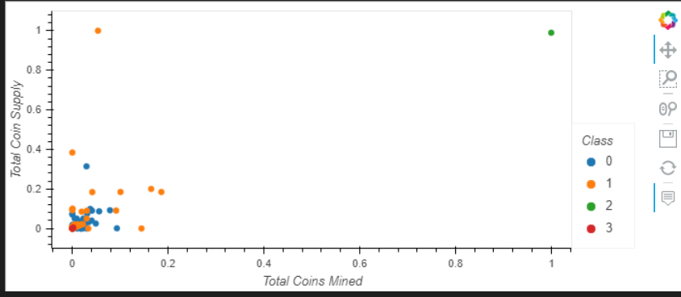

# Cryptocurrencies

## Overview of Analysis

This is an analysis of different cryptocurrencies pulled from <b><i>CryptoCompare.com</i></b>. As we do not have any overall understanding of the dataset and whether any of the columns / features have any significance, we tried to incorporate some unsupervised machine learning models to compare and cluster the crypto currencies together. This is in consideration for future investments by our company.

## Methodology

As we do not know what sort of significance each column has for us, we had to follow the below cleanup procedure:

 - Drop any non-traded cryptocurrency;
 - Drop any cryptocurrency that does not have a working algorithm;
 - Drop any rows with null values, as that can not be fit in models easily;
 - Drop any non-mined cryptocurrency, as that will not increase in value;
 - Create variables for our text columns, so that they can be easily clustered; and
 - Use StandardScaler to scale features within a reasonable mean and standard deviation

After the cleanup was done, we tried to apply the Principal Component Analysis algorithm, which reduces the available features to a supplied number of features (3 in this case). This is necessary as having a lot of features will not help in clustering the dataset, and will also take a lot of resources.

After the features were reduced, we then tried to predict their cluster <i>class</i> using k-means algorithm, which tries to minimize the means from the dataset into closest clusters.

Finally, we plotted the cleaned dataset into a scatter-plot and grouped them in their respective cluster class.

</img>

